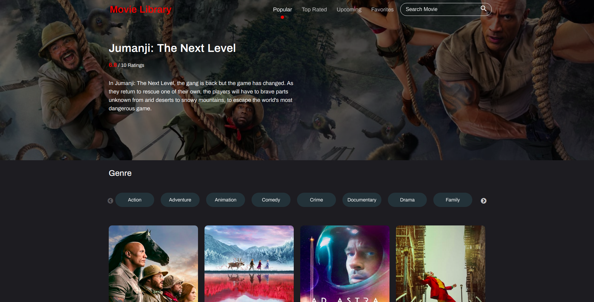

## Movie Library

### [Live demo](https://movie-db-app.netlify.com/discover/popular?page=1)



## Features

- Show list of popular, top rated, and upcoming movies
- Search movie
- Add favorites to movies

## Stacks

- React
- Redux
- Styled Components
- Netlify (hosting)

## Requirements

- api key from [The Movie Database API](https://www.themoviedb.org/documentation/api)
- Create a .env.local file

```
REACT_APP_API_KEY=your_api_key
```

## Installation

```
git clone
npm install
npm start
```
